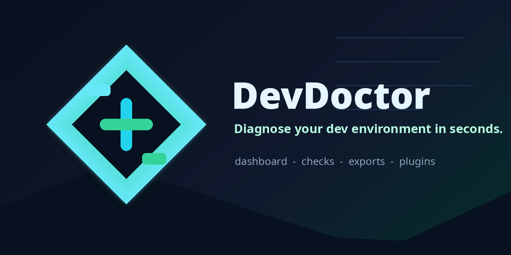
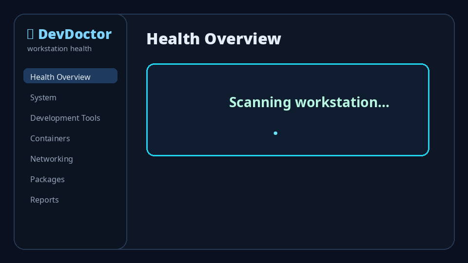
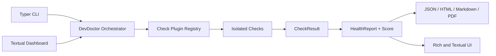

<p align="center">
  
</p>

<p align="center">
  <a href="https://github.com/imedkablavi/DevDoctor/actions/workflows/ci.yml"></a>
  <a href="https://pypi.org/project/devdoctor/"></a>
  <a href="LICENSE"></a>
  <a href="docs/DASHBOARD.md"></a>
</p>

<h1 align="center">DevDoctor</h1>

<p align="center">
  <strong>Diagnose your Linux development environment in seconds.</strong>
</p>

DevDoctor is a local CLI for checking a developer workstation before the environment wastes your afternoon. It reports system health, common development tools, containers, package managers, DNS, internet reachability, GitHub access, and exportable reports.

It is intentionally conservative: scans run as a regular user, install and cleanup actions are shown as commands to review, and one failed probe cannot stop the full report.

## Preview

<p align="center">
  
</p>

```text
◆ DevDoctor
workstation health

Health Overview
80/100  Overall workstation health
████████████████████████░░░░░░
✓ 18 passed   ⚠ 8 warnings   ✕ 0 failed

Ctrl+R refresh  •  / search  •  Ctrl+E export  •  Ctrl+F auto fix
```

## Install

DevDoctor requires Python 3.11 or newer.

```bash
python -m pip install devdoctor
```

From a checkout:

```bash
git clone https://github.com/imedkablavi/DevDoctor.git
cd DevDoctor
python -m pip install -e ".[dev]"
```

## Quick Start

```bash
devdoctor
```

The default command opens the dashboard when stdout is attached to an interactive terminal.

```bash
devdoctor --classic
devdoctor --quiet --fail-under 75
devdoctor --json --network-timeout 2
```

Export reports:

```bash
devdoctor --json-file report.json
devdoctor --html-file report.html
devdoctor --markdown-file report.md
devdoctor --pdf-file report.pdf
```

## What It Checks

| Area | Checks |
| --- | --- |
| System | Distribution, kernel, architecture, CPU, RAM, disk, uptime, GPU |
| Tools | Git, Python, Docker, Podman, Node.js, npm, pnpm, Bun, Rust, Cargo, Go, Java, GitHub CLI, kubectl, Helm, Terraform |
| Network | Internet connectivity, DNS resolution, GitHub HTTPS reachability |
| Packages | APT, DNF, Pacman, RPM, Flatpak, Snap, Homebrew, Cargo, pip, npm, pnpm |
| Reports | JSON, HTML, Markdown, compact PDF, clipboard copy, latest-report cache |

## Why Use It

DevDoctor catches the boring failures that slow down builds and onboarding:

- missing or misconfigured tools
- stopped container daemons
- broken DNS or GitHub reachability
- low disk space
- unclear package-manager state
- inconsistent workstation setup before running CI-like checks locally

It does not collect telemetry, scan networks, install packages, or delete files.

## Dashboard

The dashboard uses Textual and is built around keyboard-first navigation.

| Shortcut | Action |
| --- | --- |
| `/` | Focus search |
| `Tab` | Move to the next page |
| `Ctrl+R` | Refresh checks |
| `Ctrl+E` | Open Reports |
| `Ctrl+F` | Open Auto Fix |
| `Esc` | Go back |
| `Q` | Quit |

The dashboard is documented in [docs/DASHBOARD.md](docs/DASHBOARD.md). Script and no-color usage is documented in [docs/USAGE.md](docs/USAGE.md).

## Supported Distributions

DevDoctor has distro-aware install guidance for:

- Ubuntu
- Debian
- Fedora
- Bazzite
- Arch
- Manjaro
- Pop!_OS
- Linux Mint

Other Linux distributions can still run the checks. Package install suggestions may be less specific.

## Reports

JSON is the complete machine-readable format. HTML is a standalone visual report. Markdown is useful for issues and handoffs. The PDF exporter is dependency-free and intentionally compact.

```bash
devdoctor --json
devdoctor --html-file devdoctor-report.html
devdoctor --markdown-file devdoctor-report.md
devdoctor --pdf-file devdoctor-report.pdf
```

## Architecture



Checks return typed `CheckResult` objects. The orchestrator catches unexpected exceptions per check, calculates a weighted score, and sends the same report model to the dashboard, classic Rich output, and exporters.

## Plugins

Built-in checks are registered through `CheckPlugin` metadata. External packages can expose a zero-argument callable or a `CheckPlugin` through the `devdoctor.checks` entry point group.

Plugin checks should be fast, typed, non-destructive, and safe to run without root privileges. The checks reference is in [docs/CHECKS.md](docs/CHECKS.md).

## Development

```bash
python -m pip install -e ".[dev]"
ruff format --check .
ruff check .
pytest
python -m devdoctor --classic --quiet --network-timeout 1
```

When adding or changing a check, keep the result actionable and add focused tests. Dashboard changes should remain usable in small terminals and from the keyboard.

## Roadmap

- Signed release artifacts
- PyPI release automation
- Shell environment checks for PATH, proxies, and version managers
- Optional container runtime smoke checks
- Third-party plugin examples
- Homebrew, COPR, AUR, and distro packaging

## Documentation

- [Usage](docs/USAGE.md)
- [Dashboard](docs/DASHBOARD.md)
- [Checks reference](docs/CHECKS.md)
- [Accessibility](docs/ACCESSIBILITY.md)
- [Brand system](docs/BRAND.md)
- [Release process](docs/RELEASE.md)
- [Release notes](docs/RELEASE_NOTES_v1.0.0.md)

## License

DevDoctor is released under the MIT License. See [LICENSE](LICENSE).
