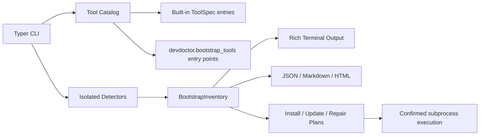

<p align="center">
  
</p>

<p align="center">
  <a href="https://github.com/imedkablavi/DevDoctor/actions/workflows/ci.yml"></a>
  
  
  <a href="LICENSE"></a>
</p>

<h1 align="center">DevDoctor</h1>

<p align="center">
  <strong>Bootstrap and repair Linux developer workstations.</strong>
</p>

DevDoctor inventories a Linux workstation, detects developer tools, explains broken setups, and shows the safest package-manager commands needed to install, update, verify, repair, or remove them.

It is not a system monitor and it is not a scorecard. The default output is a plain terminal report built from local system data: distribution, package managers, shell, desktop/session, virtualization, PATH, language runtimes, container tooling, cloud CLIs, databases, security tools, build systems, and common terminal utilities.

DevDoctor does not run privileged commands during a scan. Commands that change the system are shown first and only run when you pass `--apply` and confirm them.

## Terminal Preview

```text
$ devdoctor check --profile devops --missing

DevDoctor  v1.1.0             4 installed  7 missing  2 warnings  0 broken
Linux developer workstation bootstrap

Host
OS             Fedora Linux 42        Arch        x86_64
Shell          bash                   Desktop     GNOME
Session        wayland                Terminal    xterm-256color
Managers       dnf, flatpak, pip      PATH issues 1

Containers
! Docker       warning    29.0.0      /usr/bin/docker
  Repair: Docker daemon is not running
  Verify: docker info

DevOps
✗ kubectl                                     sudo dnf install kubernetes-client
✗ Helm                                        sudo dnf install helm
✗ Terraform                                   sudo dnf install terraform
```

## Install

DevDoctor requires Python 3.11 or newer.

```bash
python -m pip install devdoctor
```

From a checkout:

```bash
git clone https://github.com/imedkablavi/DevDoctor.git
cd DevDoctor
python -m pip install -e ".[dev]"
```

## Quick Start

```bash
devdoctor
devdoctor check --profile general
devdoctor check git docker node
devdoctor --json | python -m json.tool
devdoctor search docker
devdoctor repair docker
```

Preview installation work without changing the machine:

```bash
devdoctor install git docker --dry-run
devdoctor install --profile devops
```

Run a plan only after review:

```bash
devdoctor install --profile frontend --apply
```

## Commands

| Command | Purpose |
| --- | --- |
| `devdoctor` | Full workstation inventory. |
| `devdoctor check [tools...]` | Inspect selected tools, a category, or a profile. |
| `devdoctor install [tools...]` | Preview or run install plans. |
| `devdoctor repair [tools...]` | Show repair suggestions for broken tools, missing dependencies, and PATH problems. |
| `devdoctor verify [tools...]` | Exit non-zero when selected tools are missing, warning, or broken. |
| `devdoctor search QUERY` | Search the local tool catalog. |
| `devdoctor list profiles` | Show built-in bootstrap profiles. |
| `devdoctor list tools` | Show catalog tool IDs without probing the system. |
| `devdoctor export json` | Export inventory JSON. |
| `devdoctor export markdown` | Export inventory Markdown. |
| `devdoctor update` | Preview package-manager update commands. |
| `devdoctor uninstall TOOL` | Preview rollback commands for catalog tools. |
| `devdoctor cache clean` | Preview supported package cache cleanup commands. |
| `devdoctor self-update` | Preview a Python package self-update command. |
| `devdoctor health` | Run the legacy non-interactive health report and exporters. |

## Profiles

Profiles keep setup focused. They do not install every tool in a category.

```bash
devdoctor list profiles
devdoctor check --profile python
devdoctor install --profile cloud --dry-run
devdoctor verify --profile general
```

Built-in profiles include `general`, `frontend`, `backend`, `python`, `node`, `rust`, `go`, `java`, `flutter`, `android`, `data-science`, `ai`, `security`, `devops`, `cloud`, and `game`.

## What DevDoctor Detects

| Area | Examples |
| --- | --- |
| System | Distribution, architecture, desktop, session type, shell, terminal, WSL, containers, virtualization, sudo availability, PATH issues. |
| Package managers | APT, DNF, rpm-ostree, Pacman, yay, paru, Zypper, XBPS, APK, Nix, Flatpak, Snap, Homebrew, Cargo, Go, pip, pipx, npm, pnpm, Yarn, Gem, Composer, Rustup, Flutter, mise, asdf. |
| Languages | Python, Node.js, Bun, Rust, Go, Java, .NET, PHP, Ruby. |
| Editors | Visual Studio Code, Vim, Neovim. |
| Containers and DevOps | Docker, Podman, Distrobox, kubectl, Helm, Terraform, Ansible. |
| Cloud CLIs | GitHub CLI, AWS CLI, Azure CLI, Google Cloud CLI. |
| Data and services | PostgreSQL client, MySQL client, SQLite, Redis CLI, systemd. |
| Security and debugging | OpenSSH, GnuPG, UFW, Nmap, GDB, strace, radare2. |
| Terminal and build tools | curl, wget, jq, ripgrep, fd, fzf, Starship, GCC, Clang, Make, CMake, Ninja. |
| Mobile, AI, and games | Android Debug Bridge, Flutter, Ollama, CUDA compiler, Godot. |

For each tool DevDoctor records installed state, executable path, parsed version, owning package where the platform can report it, inferred installation method, existing configuration locations, dependency status, health state, repair recommendations, and a distro-aware install plan when one is available.

## Intelligent Repair

DevDoctor v1.1.0 adds a repair engine that turns local evidence into explicit next steps. It currently detects:

- Docker CLI installed while the daemon is stopped or the socket is not accessible.
- Git without global `user.name` or `user.email`.
- Missing SSH public keys for Git and server workflows.
- Python without working `pip`.
- Node.js without `npm`.
- Java without `JAVA_HOME`.
- Cargo installations where `~/.cargo/bin` exists but is not exported.
- Flutter Android toolchain gaps.
- Broken executable symlinks, non-executable commands, and duplicate PATH installations.

Repair output always includes the problem, reason, risk, repair command or manual action, and verification command when one is available. DevDoctor does not run repair commands from `repair`; it reports them.

## PATH Analysis

The bootstrap inventory includes a PATH analyzer. It reports empty PATH entries, duplicate directories, missing directories, entries that are not directories, non-searchable directories, common user binary directories that exist but are not exported, and shadowed executables.

When the fix is a shell export, DevDoctor prints the exact command it can safely infer. It never edits shell startup files automatically.

## Export Formats

```bash
devdoctor --json > inventory.json
devdoctor --json-file inventory.json
devdoctor --markdown-file inventory.md
devdoctor --html-file inventory.html
devdoctor export json --output inventory.json
devdoctor export markdown --output inventory.md
```

The JSON export is the stable machine-readable format. Markdown is meant for issues, handoffs, and onboarding notes. HTML is a standalone local report with the raw JSON embedded.

## Safety Model

- Scans run as the current user.
- DevDoctor never uses `shell=True`.
- Install, update, uninstall, cache, and self-update commands are previewed first.
- `--apply` is required before any command is executed.
- Unless `--yes` is passed, each command still asks for confirmation.
- Executed operations are logged as JSON Lines under the user state directory, usually `~/.local/state/devdoctor/operations.log`.
- Successful install and uninstall commands run their verification command afterward when the catalog knows one.
- DevDoctor does not store secrets, tokens, package-manager credentials, or shell history.

## Supported Distributions

DevDoctor has distro-aware install planning for Ubuntu, Debian, Fedora, Bazzite, Arch, Manjaro, Pop!_OS, and Linux Mint. It also includes package-manager support for openSUSE, Void Linux, Alpine Linux, Nix, Homebrew on Linux, Flatpak, Snap, and common language package managers.

Other Linux distributions can still run the inventory. Install plans appear when a supported package manager is detected and the catalog has a package mapping for the tool.

## Architecture



The bootstrap layer is centered on `ToolSpec`, `ToolDetection`, `InstallPlan`, `BootstrapProfile`, and `BootstrapInventory`. Each detector is isolated, command execution is bounded, and unexpected command failures are converted into data instead of crashing the scan.

The legacy `devdoctor health` command keeps the older check/report model for users that still need health-style JSON, HTML, Markdown, or PDF reports. It is not the default workflow.

## Plugin Catalog

Third-party packages can add bootstrap tools with the `devdoctor.bootstrap_tools` entry point group. An entry point may return a `ToolSpec` or an iterable of `ToolSpec` instances.

```toml
[project.entry-points."devdoctor.bootstrap_tools"]
mytools = "my_package.devdoctor:get_tools"
```

Plugin detectors should be fast, local, non-destructive, and safe to run without root privileges.

## Development

```bash
python -m pip install -e ".[dev]"
ruff format --check .
ruff check .
pytest
python -m devdoctor --quiet
python -m devdoctor --json | python -m json.tool
```

When changing catalog entries, add or update tests for install-plan selection, version parsing, and profile coverage. When changing CLI output, verify both a narrow terminal and machine-readable JSON.

## Roadmap

- More official package mappings for SUSE, Void, Alpine, Nix, and language managers.
- External plugin examples.
- Signed release artifacts and PyPI publication workflow.
- Optional package-manager dry-run parsers for dependency and download-size reporting where the manager exposes real data.
- More repair checks for distro-specific package metadata and service managers.

## FAQ

**Does DevDoctor install packages by default?**  
No. Inventory and planning are read-only. Use `--apply` to execute a reviewed command.

**Why not show a health score?**  
A workstation is only "ready" relative to the project in front of you. DevDoctor shows concrete installed, missing, and broken tools instead of compressing that into a score.

**Can I use it in CI or onboarding scripts?**  
Yes. Use `devdoctor verify --profile general --quiet` or `devdoctor --json` depending on whether you need an exit code or structured data.

**Does it support non-Linux systems?**  
No. DevDoctor is intentionally Linux-first.

## Documentation

- [Usage](docs/USAGE.md)
- [Checks and catalog reference](docs/CHECKS.md)
- [Accessibility](docs/ACCESSIBILITY.md)
- [Brand system](docs/BRAND.md)
- [Release process](docs/RELEASE.md)
- [Release notes](docs/RELEASE_NOTES_v1.1.0.md)

## License

DevDoctor is released under the MIT License. See [LICENSE](LICENSE).
